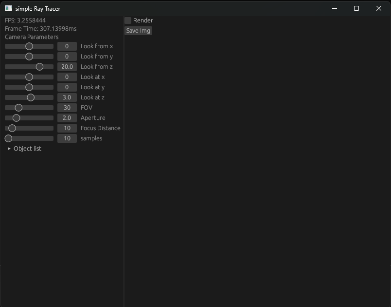
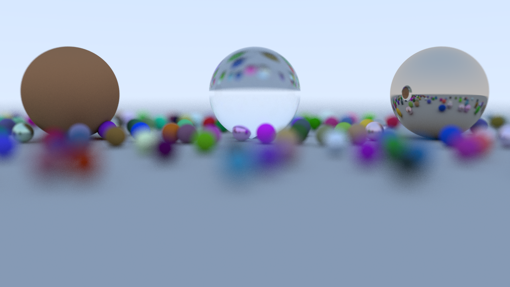
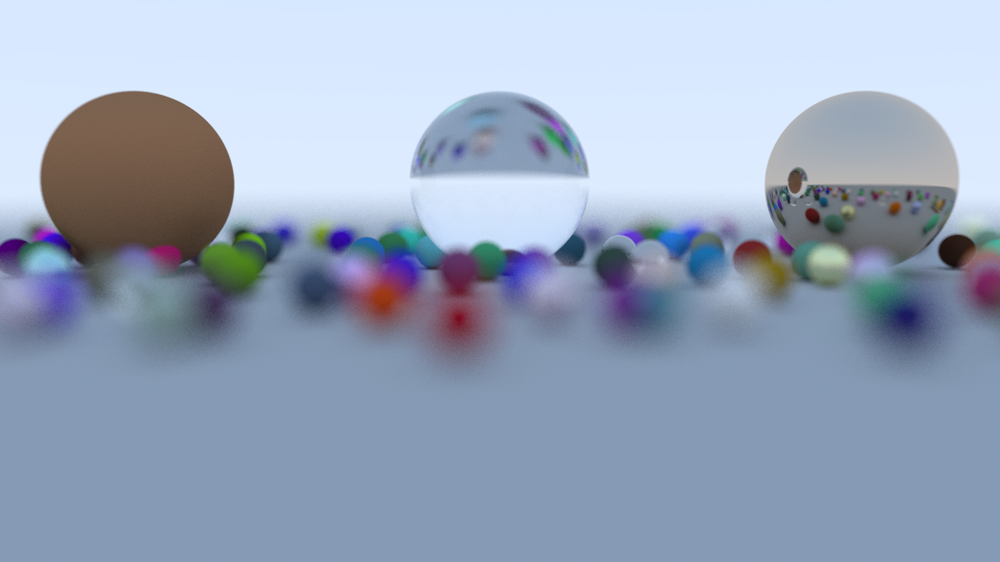

# Simple Ray Tracer
## ✨ ray tracer made in rust ✨


### This is a very simple ray tracer written in rust as learning rust language,
### it has only basic functionaly with gui.

You can download build from release.

## Features

- It only has a sphere object.
- It has three materials-
- Lambertian 
- Metal
- Dielectric

This is made by using refrence from this book called "Ray Tracing in One Weekend".
Link - [https://raytracing.github.io/books/RayTracingInOneWeekend.html]








## build for linux

may need to install dependencies for egui and eframe.

```sh
cargo build -r
```

## Build for windows
here i used cross tool to compile for windows, if you use this first setup cross.
[cross](https://github.com/cross-rs/cross.git)
[https://github.com/cross-rs/cross.git]
```sh
cross build --target x86_64-pc-windows-gnu --release
```


